# DMR Gateway

**Project Codename:** `dmr-gateway`  
**Specification Version:** `0.2.0`  
**Document Status:** Architecture & Product Specification  
**Last Updated:** 2026-10-01  
**Target:** Raspberry Pi / Linux / Docker  
**License:** TBD

---

## Table of Contents

1. [Project Overview](#1-project-overview)
2. [Vision](#2-vision)
3. [Problem Statement](#3-problem-statement)
4. [Design Principles](#4-design-principles)
5. [UI Previews](#5-ui-previews)
6. [Goals](#6-goals)
7. [Non-Goals](#7-non-goals)
8. [Core Concepts](#8-core-concepts)
9. [System Architecture](#9-system-architecture)
10. [Trust Boundaries](#10-trust-boundaries)
11. [Event-Driven Architecture](#11-event-driven-architecture)
12. [Event Model](#12-event-model)
13. [Device Abstraction](#13-device-abstraction)
14. [DMR Backend Architecture](#14-dmr-backend-architecture)
15. [MMDVM Integration](#15-mmdvm-integration)
16. [Motorola IPSC Integration](#16-motorola-ipsc-integration)
17. [Hytera Integration](#17-hytera-integration)
18. [Rules Engine](#18-rules-engine)
19. [Conditions](#19-conditions)
20. [Actions](#20-actions)
21. [Workflows](#21-workflows)
22. [Task and Job System](#22-task-and-job-system)
23. [Alert System](#23-alert-system)
24. [DMR Command System](#24-dmr-command-system)
25. [Radio Identity and Authorization](#25-radio-identity-and-authorization)
26. [TTS Architecture](#26-tts-architecture)
27. [MQTT and Home Assistant](#27-mqtt-and-home-assistant)
28. [Cellular SMS Gateway](#28-cellular-sms-gateway)
29. [Hardware Agent](#29-hardware-agent)
30. [Edge Functions](#30-edge-functions)
31. [Secrets Management](#31-secrets-management)
32. [Authentication and Authorization](#32-authentication-and-authorization)
33. [Security Architecture](#33-security-architecture)
34. [Audit Logging](#34-audit-logging)
35. [Observability](#35-observability)
36. [Event Explorer](#36-event-explorer)
37. [Simulation and Dry-Run](#37-simulation-and-dry-run)
38. [Event Replay](#38-event-replay)
39. [Web Application](#39-web-application)
40. [CLI](#40-cli)
41. [Database Model](#41-database-model)
42. [API Design](#42-api-design)
43. [WebSocket Design](#43-websocket-design)
44. [Internal Service Contracts](#44-internal-service-contracts)
45. [Configuration](#45-configuration)
46. [Docker Architecture](#46-docker-architecture)
47. [Networking](#47-networking)
48. [Persistence](#48-persistence)
49. [Reliability](#49-reliability)
50. [Failure Handling](#50-failure-handling)
51. [Rate Limiting](#51-rate-limiting)
52. [Validation](#52-validation)
53. [Testing Strategy](#53-testing-strategy)
54. [Developer Experience](#54-developer-experience)
55. [Repository Structure](#55-repository-structure)
56. [Technology Stack](#56-technology-stack)
57. [Development Phases](#57-development-phases)
58. [Milestones](#58-milestones)
59. [Operational Runbook](#59-operational-runbook)
60. [Backup and Recovery](#60-backup-and-recovery)
61. [Upgrade Strategy](#61-upgrade-strategy)
62. [Performance Targets](#62-performance-targets)
63. [Future Features](#63-future-features)
64. [Example Automations](#64-example-automations)
65. [Example API Requests](#65-example-api-requests)
66. [Example Event Payloads](#66-example-event-payloads)
67. [Architectural Decisions](#67-architectural-decisions)
68. [Open Questions](#68-open-questions)
69. [Definition of Done](#69-definition-of-done)
70. [Conclusion](#70-conclusion)

---

# 1. Project Overview

DMR Gateway is a self-hosted, Docker-based, event-driven automation platform designed to connect DMR radio infrastructure with physical hardware, messaging systems, home automation platforms, web services, cellular networks, and user-defined automation.

The initial target platform is a Raspberry Pi or another Linux host, but the architecture is intentionally designed so that the same software can run on x86_64 servers, ARM64 systems, virtual machines, and larger dedicated infrastructure.

The platform treats DMR as both:

- an **event source**, and
- an **action destination**.

This distinction is fundamental.

A DMR transmission can generate an event:

```text
DMR SMS received
DMR PTT started
DMR PTT ended
DMR voice transmission started
DMR voice transmission ended
Radio registration changed
Talkgroup activity detected
```

Those events can then be processed by the automation engine.

Conversely, automation can produce DMR actions:

```text
Send DMR SMS
Broadcast TTS audio
Trigger a DMR alert
Send a confirmation
```

The system is not limited to DMR. Other event sources and action targets include:

```text
MQTT
HTTP
GPIO
Serial
Cellular SMS
Schedules
Webhooks
Cameras
Home Assistant
Edge Functions
```

The long-term objective is to provide a unified automation layer where radio activity can participate in the same automation model as IoT and software events.

---

# 2. Vision

The project should evolve into:

> **A self-hosted event-driven automation platform for DMR networks and connected infrastructure.**

The platform should allow an operator to construct automations such as:

```text
DMR SMS
    |
    v
Authorization
    |
    v
Rule
    |
    v
Workflow
    |
    +----> Unlock door
    |
    +----> Send confirmation SMS
    |
    +----> Publish MQTT event
    |
    +----> Record audit entry
```

Or:

```text
Home Assistant
    |
    | MQTT
    v
DMR Gateway
    |
    +----> TTS announcement
    |
    +----> DMR SMS
    |
    +----> Cellular SMS
```

Or:

```text
GPIO sensor
    |
    v
Event
    |
    v
Rule
    |
    +----> DMR alert
    +----> MQTT
    +----> SMS
    +----> HTTP webhook
```

The central architectural idea is:

```text
EVENT
  |
  v
RULE
  |
  v
WORKFLOW
  |
  v
ACTION
  |
  v
JOB
  |
  v
EXECUTION
```

This model prevents individual integrations from becoming tightly coupled.

---

# 3. Problem Statement

DMR infrastructure often exists as isolated systems.

A typical environment may contain:

- a DMR repeater;
- an MMDVM hotspot;
- a Raspberry Pi;
- GPIO-controlled equipment;
- a cellular modem;
- Home Assistant;
- IP cameras;
- door controllers;
- MQTT devices;
- HTTP APIs;
- monitoring systems.

Each system may have its own API, protocol, configuration and logging.

This creates several problems:

1. Radio events cannot easily trigger modern automation.
2. Automation systems cannot easily communicate back to radio users.
3. Hardware actions become custom scripts.
4. Security policy is fragmented.
5. Logs are distributed across multiple services.
6. There is no unified event history.
7. There is no consistent authorization model.
8. Testing automation often requires real hardware.
9. Adding another RF backend can require application-wide changes.
10. User-written automation is difficult to isolate safely.

DMR Gateway addresses these problems with a normalized event and action architecture.

---

# 4. Design Principles

## 4.1 Event First

Everything important should be represented as an event.

Examples:

```text
dmr.sms.received
dmr.ptt.started
mqtt.message.received
gpio.state.changed
cellular.sms.received
schedule.triggered
alert.triggered
function.completed
```

---

## 4.2 Hardware Is an Adapter

The core application should not directly manipulate GPIO, serial devices, radio hardware, modems, cameras or proprietary protocols.

Instead:

```text
Core
 |
 +--> Adapter
       |
       +--> Device
```

This isolates hardware-specific behavior.

---

## 4.3 Actions Are Pluggable

Adding a new action should not require redesigning the rules engine.

An action should implement a common interface.

Examples:

```text
dmr.send_sms
dmr.broadcast_audio
mqtt.publish
gpio.set
gpio.pulse
serial.write
http.request
hikvision.unlock
sms.send
function.execute
delay
condition
```

---

## 4.4 Security Is a Platform Feature

Security must not be bolted on later.

The system must assume:

- network requests can be malicious;
- DMR commands can be forged or unauthorized;
- users can make mistakes;
- user-written code is untrusted;
- external APIs can fail;
- credentials can leak;
- hardware actions can have real-world consequences.

---

## 4.5 Observable by Default

Every important operation should be traceable.

The system should answer:

> What happened?

> Why did it happen?

> Which rule caused it?

> Which version of the rule ran?

> Who or what triggered it?

> What actions executed?

> What failed?

A correlation ID should connect all related records.

---

## 4.6 Simulation First

Every dangerous action should support dry-run or simulation wherever practical.

The operator should be able to test:

```text
event
 -> rule
 -> conditions
 -> actions
```

without actually unlocking a door, toggling a relay or transmitting RF.

---

## 4.7 Raspberry Pi Friendly

The default installation should be suitable for modest hardware.

Avoid requiring:

- Kubernetes;
- a large cluster;
- heavyweight observability infrastructure;
- multiple mandatory databases;
- excessive containers.

Optional components should remain optional.

---


# 5. UI Previews

This section provides a comprehensive visual reference of the DMR Gateway web application interface. Each screenshot is accompanied by a detailed breakdown of layout, data panels, interactive elements, and operational purpose.

> **Note:** These previews represent the intended look-and-feel of the control plane. Exact layout, data, and feature set will evolve during implementation. All screenshots shown below were captured from a high-fidelity prototype running against simulated multi-network DMR traffic.

---

## 5.1 Control Room

**Route:** `/` or `/control-room`  
**Purpose:** Primary real-time operational dashboard. This is the first screen an operator sees after login and the main surface for monitoring live RF activity, network health, and system status.

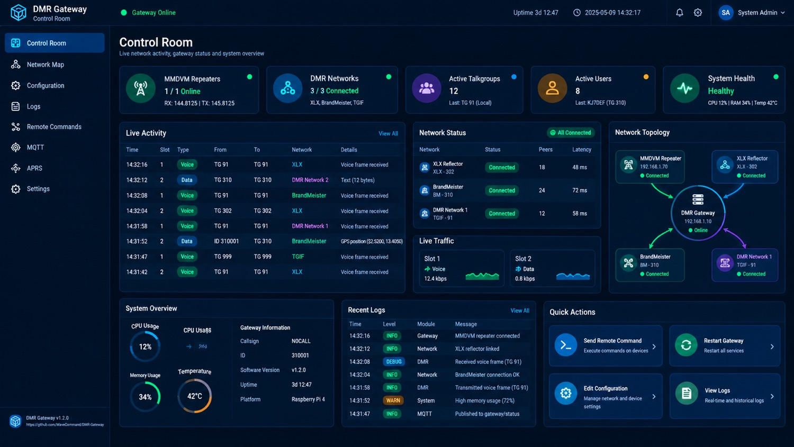

### Layout Overview

| Region | Content |
|--------|---------|
| Left Sidebar | Persistent navigation (Control Room, Network Map, Configuration, Logs, Remote Commands, MQTT, APRS, Settings) |
| Top Bar | Gateway online indicator, uptime, current timestamp, notification bell, settings gear, user menu (System Admin) |
| Main Header | Page title “Control Room” + subtitle “Live network activity, gateway status and system overview” |
| KPI Cards (top row) | Five summary cards |
| Middle Row | Live Activity table + Network Status + Network Topology |
| Bottom Row | System Overview + Recent Logs + Quick Actions |

### KPI Cards (left → right)

1. **MMDVM Repeaters**  
   - Status: 1 / 1 Online  
   - Frequency pair: RX 144.8125 / TX 145.8125  
   - Green status dot

2. **DMR Networks**  
   - Status: 3 / 3 Connected  
   - Networks listed: XLX, BrandMeister, TGIF  
   - Green status dot

3. **Active Talkgroups**  
   - Count: 12  
   - Last activity: TG 91 (Local)

4. **Active Users**  
   - Count: 8  
   - Last heard: KJ7DEF (TG 310)

5. **System Health**  
   - Status: Healthy  
   - Metrics: CPU 12% | RAM 34% | Temp 42°C

### Live Activity Table

Columns: Time | Slot | Type | From | To | Network | Details

Example rows visible in the screenshot:

| Time | Slot | Type | From | To | Network | Details |
|------|------|------|------|----|---------|---------|
| 14:32:16 | 1 | Voice | TG 91 | TG 91 | XLX | Voice frame received |
| 14:32:12 | 2 | Data | TG 310 | TG 310 | DMR Network 2 | Text (12 bytes) |
| 14:32:08 | 1 | Voice | TG 91 | TG 91 | BrandMeister | Voice frame received |
| 14:32:04 | 2 | Voice | TG 302 | TG 302 | XLX | Voice frame received |
| 14:31:58 | 1 | Voice | TG 91 | TG 91 | DMR Network 1 | Voice frame received |
| 14:31:52 | 2 | Data | ID 310001 | TG 310 | BrandMeister | GPS position (52.5200,13.4050) |
| 14:31:47 | 1 | Voice | TG 999 | TG 999 | TGIF | Voice frame received |
| 14:31:42 | 2 | Voice | TG 91 | TG 91 | XLX | Voice frame received |

### Network Status Panel

| Network | Status | Peers | Latency |
|---------|--------|-------|---------|
| XLX Reflector (XLX-302) | Connected | 18 | 48 ms |
| BrandMeister (BM-310) | Connected | 24 | 72 ms |
| DMR Network 1 (TGIF-91) | Connected | 12 | 58 ms |

### Network Topology

Visual node graph with the DMR Gateway (192.168.1.10) at the centre, connected to:

- MMDVM Repeater (192.168.1.70)
- XLX Reflector (XLX-302)
- BrandMeister (BM-310)
- DMR Network 1 (TGIF-91)

### System Overview

- CPU Usage: 12% (circular gauge)
- Memory Usage: 34%
- Temperature: 42°C
- Gateway Information: Callsign NOCALL, ID 310001, Software Version v1.2.0, Uptime 3d 12:47, Platform Raspberry Pi 4

### Recent Logs (sample)

| Time | Level | Module | Message |
|------|-------|--------|---------|
| 14:32:16 | INFO | Gateway | MMDVM repeater connected |
| 14:32:12 | INFO | Network | XLX reflector linked |
| 14:32:08 | DEBUG | DMR | Received voice frame (TG 91) |
| 14:32:04 | INFO | Network | BrandMeister connection OK |
| 14:31:58 | INFO | DMR | Transmitted voice frame (TG 91) |
| 14:31:52 | WARN | System | High memory usage (72%) |
| 14:31:47 | INFO | MQTT | Published to gateway/status |

### Quick Actions

- Send Remote Command
- Restart Gateway
- Edit Configuration
- View Logs

---

## 5.2 Network Map

**Route:** `/network-map`  
**Purpose:** Geographic and logical visualisation of the entire DMR footprint — repeaters, gateways, users, and inter-network links.

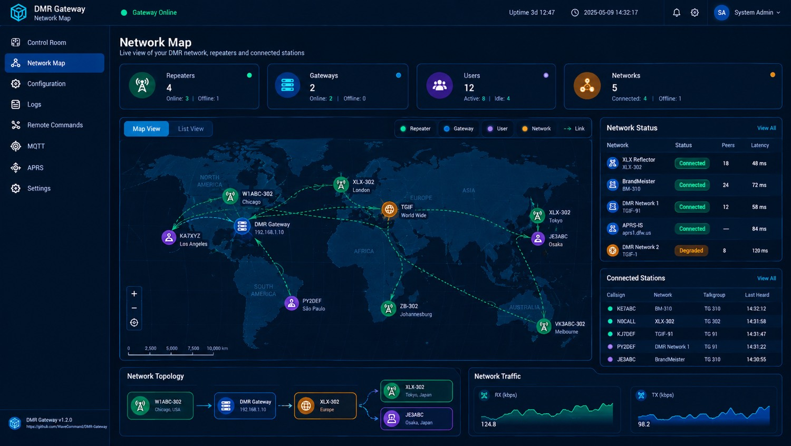

### Summary Cards

| Card | Value |
|------|-------|
| Repeaters | 4 Online / 1 Offline |
| Gateways | 2 Online / 0 Offline |
| Users | 12 total (8 Active / 4 Idle) |
| Networks | 5 total (4 Connected / 1 Offline) |

### Map View

Interactive world map with colour-coded markers:

- Green = Repeater
- Blue = Gateway
- Purple = User
- Orange = Network

Visible stations include:

- W1ABC-302 (Chicago)
- XLX-302 (London)
- TGIF World Wide
- XLX-302 (Tokyo)
- JE3ABC (Osaka)
- KA7XYZ (Los Angeles)
- PY2DEF (São Paulo)
- ZB-302 (Johannesburg)
- VK3ABC-302 (Melbourne)

Dashed green lines represent active network links.

### Network Status Sidebar

| Network | Status | Peers | Latency |
|---------|--------|-------|---------|
| XLX Reflector (XLX-302) | Connected | 18 | 48 ms |
| BrandMeister (BM-310) | Connected | 24 | 72 ms |
| DMR Network 1 (TGIF-91) | Connected | 12 | 58 ms |
| APRS-IS (aprs1.dfw.us) | Connected | — | 84 ms |
| DMR Network 2 (TGIF-1) | Degraded | 8 | 120 ms |

### Connected Stations Table

| Callsign | Network | Talkgroup | Last Heard |
|----------|---------|-----------|------------|
| KE7ABC | BM-310 | TG 310 | 14:32:12 |
| NOCALL | XLX-302 | TG 302 | 14:31:58 |
| KJ7DEF | TGIF-91 | TG 91 | 14:31:47 |
| PY2DEF | DMR Network 1 | TG 91 | 14:31:22 |
| JE3ABC | BrandMeister | TG 310 | 14:30:55 |

### Network Topology (bottom)

Linear flow: W1ABC-302 (Chicago) → DMR Gateway (192.168.1.10) → XLX-302 (Europe) → branching to XLX-302 (Tokyo) and JE3ABC (Osaka).

### Network Traffic Graphs

- RX (kbps) — green line, current ~124.8
- TX (kbps) — blue line, current ~98.2

---

## 5.3 Configuration – Gateway

**Route:** `/configuration` (Gateway tab)  
**Purpose:** Core identity, network enablement, repeater list, talkgroup defaults, and advanced RF parameters.

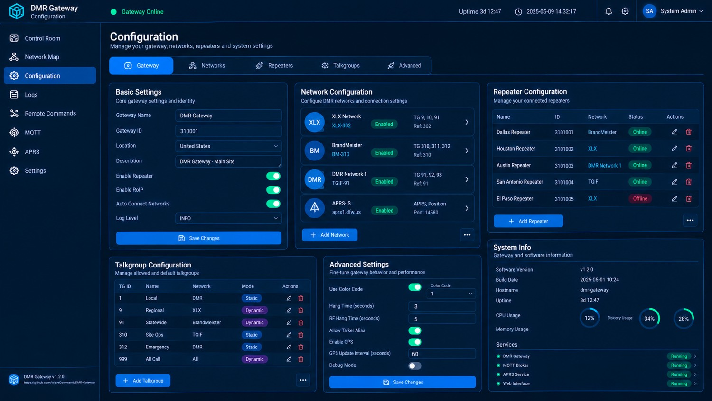

### Tabs

Gateway | Networks | Repeaters | Talkgroups | Advanced

### Basic Settings

| Field | Value |
|-------|-------|
| Gateway Name | DMR-Gateway |
| Gateway ID | 310001 |
| Location | United States |
| Description | DMR Gateway - Main Site |
| Enable Repeater | On |
| Enable RoIP | On |
| Auto Connect Networks | On |
| Log Level | INFO |

### Network Configuration

| Network | Status | Talkgroups | Reference |
|---------|--------|------------|-----------|
| XLX Network (XLX-302) | Enabled | TG 9, 10, 91 | Ref: 302 |
| BrandMeister (BM-310) | Enabled | TG 310, 311, 312 | Ref: 310 |
| DMR Network 1 (TGIF-91) | Enabled | TG 91, 92, 93 | Ref: 91 |
| APRS-IS (aprs1.dfw.us) | Enabled | APRS Position | Port: 14580 |

### Repeater Configuration Table

| Name | ID | Network | Status |
|------|----|---------|--------|
| Dallas Repeater | 3101001 | BrandMeister | Online |
| Houston Repeater | 3101002 | XLX | Online |
| Austin Repeater | 3101003 | DMR Network 1 | Online |
| San Antonio Repeater | 3101004 | TGIF | Online |
| El Paso Repeater | 3101005 | XLX | Offline |

### Talkgroup Configuration

| TG ID | Name | Network | Mode |
|-------|------|---------|------|
| 1 | Local | DMR | Static |
| 9 | Regional | XLX | Dynamic |
| 91 | Statewide | BrandMeister | Dynamic |
| 310 | Site Ops | TGIF | Static |
| 312 | Emergency | DMR | Static |
| 999 | All Call | All | Dynamic |

### Advanced Settings

- Use Color Code: On (Color Code 1)
- Hang Time: 3 seconds
- RF Hang Time: 5 seconds
- Allow Talker Alias: On
- Enable GPS: On
- GPS Update Interval: 60 seconds
- Debug Mode: Off

### System Info

Software Version v1.2.0 | Build Date 2025-05-01 10:24 | Hostname dmr-gateway | Uptime 3d 12:47 | CPU 12% | Memory 34% | Disk 28%

Services running: DMR Gateway, MQTT Broker, APRS Service, Web Interface.

---

## 5.4 Configuration – Network

**Route:** `/configuration` (Network tab)  
**Purpose:** Low-level network interfaces, DNS, routing, firewall, and live interface statistics.

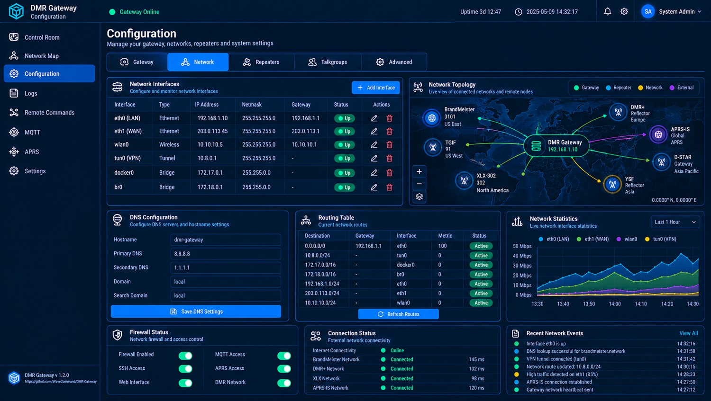

### Network Interfaces Table

| Interface | Type | IP Address | Netmask | Gateway | Status |
|-----------|------|------------|---------|---------|--------|
| eth0 (LAN) | Ethernet | 192.168.1.10 | 255.255.255.0 | 192.168.1.1 | Up |
| eth1 (WAN) | Ethernet | 203.0.113.45 | 255.255.255.0 | 203.0.113.1 | Up |
| wlan0 | Wireless | 10.10.10.5 | 255.255.255.0 | 10.10.10.1 | Up |
| tun0 (VPN) | Tunnel | 10.8.0.1 | 255.255.255.0 | — | Up |
| docker0 | Bridge | 172.17.0.1 | 255.255.0.0 | — | Up |
| br0 | Bridge | 172.18.0.1 | 255.255.0.0 | — | Up |

### DNS Configuration

- Hostname: dmr-gateway
- Primary DNS: 8.8.8.8
- Secondary DNS: 1.1.1.1
- Domain: local
- Search Domain: local

### Routing Table

| Destination | Gateway | Interface | Metric | Status |
|-------------|---------|-----------|--------|--------|
| 0.0.0.0/0 | 192.168.1.1 | eth0 | 100 | Active |
| 10.8.0.0/24 | — | tun0 | 0 | Active |
| 172.17.0.0/16 | — | docker0 | 0 | Active |
| 172.18.0.0/16 | — | br0 | 0 | Active |
| 192.168.1.0/24 | — | eth0 | 0 | Active |
| 203.0.113.0/24 | — | eth1 | 0 | Active |
| 10.10.10.0/24 | — | wlan0 | 0 | Active |

### Firewall Status

- Firewall Enabled: On
- SSH Access: On
- Web Interface: On
- MQTT Access: On
- APRS Access: On
- DMR Network: On

### Connection Status

| Target | Status | Latency |
|--------|--------|---------|
| Internet Connectivity | Online | — |
| BrandMeister Network | Connected | 145 ms |
| DMR+ Network | Connected | 132 ms |
| XLX Network | Connected | 98 ms |
| APRS-IS Network | Connected | 120 ms |

### Network Topology Map

Central DMR Gateway (192.168.1.10) linked to BrandMeister (US East), TGIF (US West), XLX-302 (North America), DMR+ Reflector (Europe), APRS-IS (Global), D-STAR Gateway (Asia Pacific), YSF Reflector (Asia).

### Network Statistics Graph

Multi-line chart (Last 1 Hour) showing eth0 (LAN), eth1 (WAN), wlan0, tun0 (VPN) throughput.

### Recent Network Events

- Interface eth0 is up
- DNS lookup successful for brandmeister.network
- VPN tunnel connected (tun0)
- Network route updated: 10.8.0.0/24
- High traffic detected on eth1 (85%)
- APRS-IS connection established
- Gateway network heartbeat sent

---

## 5.5 Repeaters

**Route:** `/repeaters`  
**Purpose:** Inventory, status, location mapping, traffic monitoring, and detailed statistics for every connected repeater.

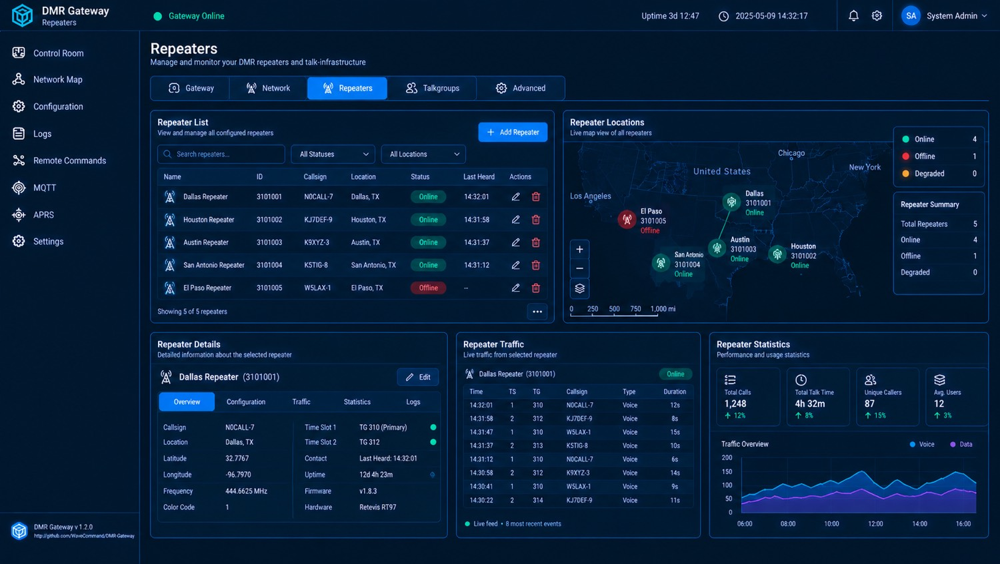

### Repeater List

| Name | ID | Callsign | Location | Status | Last Heard |
|------|----|----------|----------|--------|------------|
| Dallas Repeater | 3101001 | N0CALL-7 | Dallas, TX | Online | 14:32:01 |
| Houston Repeater | 3101002 | KJ7DEF-9 | Houston, TX | Online | 14:31:58 |
| Austin Repeater | 3101003 | K9XYZ-3 | Austin, TX | Online | 14:31:37 |
| San Antonio Repeater | 3101004 | K5TIG-8 | San Antonio, TX | Online | 14:31:12 |
| El Paso Repeater | 3101005 | WSLAX-1 | El Paso, TX | Offline | — |

### Geographic Map

US map with markers for Dallas, Houston, Austin, San Antonio (online) and El Paso (offline).

### Repeater Summary

- Total Repeaters: 5
- Online: 4
- Offline: 1
- Degraded: 0

### Selected Repeater Details (Dallas Repeater 3101001)

| Field | Value |
|-------|-------|
| Callsign | N0CALL-7 |
| Location | Dallas, TX |
| Latitude | 32.7767 |
| Longitude | -96.7970 |
| Frequency | 444.6625 MHz |
| Color Code | 1 |
| Time Slot 1 | TG 310 (Primary) |
| Time Slot 2 | TG 312 |
| Contact | Last Heard: 14:32:01 |
| Uptime | 12d 4h 23m |
| Firmware | v1.8.3 |
| Hardware | Retevis RT97 |

### Live Traffic (Dallas)

Recent voice calls with TS, TG, Callsign, Type, Duration.

### Repeater Statistics

- Total Calls: 1,248 (+12%)
- Total Talk Time: 4h 32m (+8%)
- Unique Callers: 87 (+15%)
- Avg. Users: 12 (+3%)

Traffic Overview graph (Voice vs Data) over a full day.

---

## 5.6 Talkgroups

**Route:** `/talkgroups`  
**Purpose:** Full talkgroup inventory, live activity, member lists, statistics, and per-talkgroup configuration.

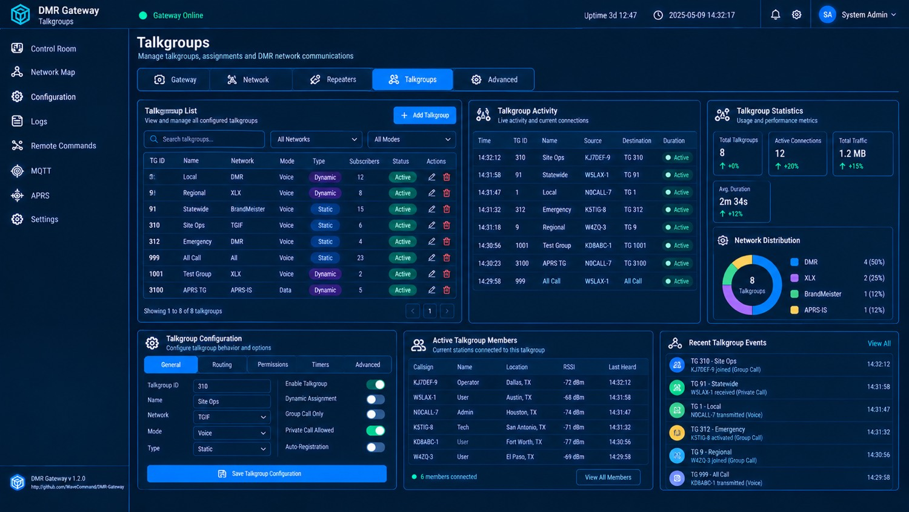

### Talkgroup List

| TG ID | Name | Network | Mode | Type | Subscribers | Status |
|-------|------|---------|------|------|-------------|---------|
| 1 | Local | DMR | Voice | Dynamic | 12 | Active |
| 9 | Regional | XLX | Voice | Dynamic | 8 | Active |
| 91 | Statewide | BrandMeister | Voice | Static | 15 | Active |
| 310 | Site Ops | TGIF | Voice | Static | 6 | Active |
| 312 | Emergency | DMR | Voice | Static | 4 | Active |
| 999 | All Call | All | Voice | Static | 23 | Active |
| 1001 | Test Group | XLX | Voice | Dynamic | 2 | Active |
| 3100 | APRS TG | APRS-IS | Data | Dynamic | 5 | Active |

### Talkgroup Activity (live)

Recent activity with Time, TG ID, Name, Source, Destination, Duration, Status.

### Talkgroup Statistics

- Total Talkgroups: 8
- Active Connections: 12 (+20%)
- Total Traffic: 1.2 MB (+15%)
- Avg. Duration: 2m 34s (+12%)

### Network Distribution (pie)

- DMR: 4 (50%)
- XLX: 2 (25%)
- BrandMeister: 1 (12%)
- APRS-IS: 1 (12%)

### Active Members (example for TG 310)

| Callsign | Name | Location | RSSI | Last Heard |
|----------|------|----------|------|------------|
| KJ7DEF-9 | Operator | Dallas, TX | -72 dBm | 14:32:12 |
| WSLAX-1 | User | Austin, TX | -68 dBm | 14:31:58 |
| N0CALL-7 | Admin | Houston, TX | -74 dBm | 14:31:47 |
| K5TIG-8 | Tech | San Antonio, TX | -71 dBm | 14:31:32 |
| KD8ABC-1 | User | Fort Worth, TX | -77 dBm | 14:30:56 |
| W4ZQ-3 | User | El Paso, TX | -69 dBm | 14:29:58 |

### Configuration Tabs

General | Routing | Permissions | Timers | Advanced

---

## 5.7 Logs

**Route:** `/logs`  
**Purpose:** Unified, filterable log viewer across all system modules with statistics and recent activity sidebar.

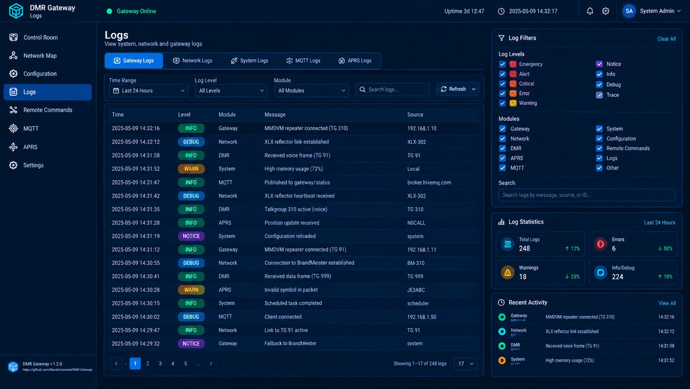

### Log Source Tabs

Gateway Logs | Network Logs | System Logs | MQTT Logs | APRS Logs

### Filters

- Time Range: Last 24 Hours
- Log Level: All Levels
- Module: All Modules
- Full-text search

### Log Level Filters (sidebar)

Emergency, Alert, Critical, Error, Warning, Notice, Info, Debug, Trace

### Module Filters

Gateway, Network, DMR, APRS, MQTT, System, Configuration, Remote Commands, Logs, Other

### Sample Log Entries

| Time | Level | Module | Message | Source |
|------|-------|--------|---------|--------|
| 2025-05-09 14:32:16 | INFO | Gateway | MMDVM repeater connected (TG 310) | 192.168.1.10 |
| 2025-05-09 14:32:12 | DEBUG | Network | XLX reflector link established | XLX-302 |
| 2025-05-09 14:31:58 | INFO | DMR | Received voice frame (TG 91) | TG 91 |
| 2025-05-09 14:31:52 | WARN | System | High memory usage (72%) | Local |
| 2025-05-09 14:31:47 | INFO | MQTT | Published to gateway/status | broker.hivemq.com |
| … | … | … | … | … |

### Log Statistics (Last 24 Hours)

- Total Logs: 248 (+12%)
- Errors: 6 (↓50%)
- Warnings: 18 (↓28%)
- Info/Debug: 224 (+18%)

### Recent Activity Sidebar

Latest events with colour-coded status dots and timestamps.

---

## 5.8 Remote Commands – Quick Commands

**Route:** `/remote-commands` (Quick Commands tab)  
**Purpose:** One-click common operations plus free-form command entry and live terminal output.

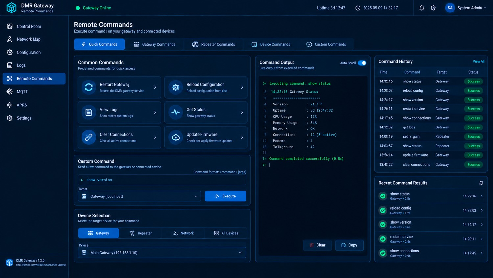

### Common Commands Grid

- Restart Gateway
- Reload Configuration
- View Logs
- Get Status
- Clear Connections
- Update Firmware

### Custom Command

- Input field with placeholder format `<command> [args]`
- Target selector (Gateway / Repeater / Network / All Devices)
- Device dropdown (e.g. Main Gateway 192.168.1.10)
- Execute button

### Command Output Terminal

Live scrolling terminal showing command execution, status lines, and completion message with timing (e.g. “Command completed successfully (0.8s)”).

### Command History

Table of recent commands with Time, Command, Target, Status (Success/Failed).

### Recent Command Results

List of latest executions with duration and success indicators.

---

## 5.9 Remote Commands – Gateway Commands

**Route:** `/remote-commands` (Gateway Commands tab)  
**Purpose:** Dedicated control surface for the gateway process itself.

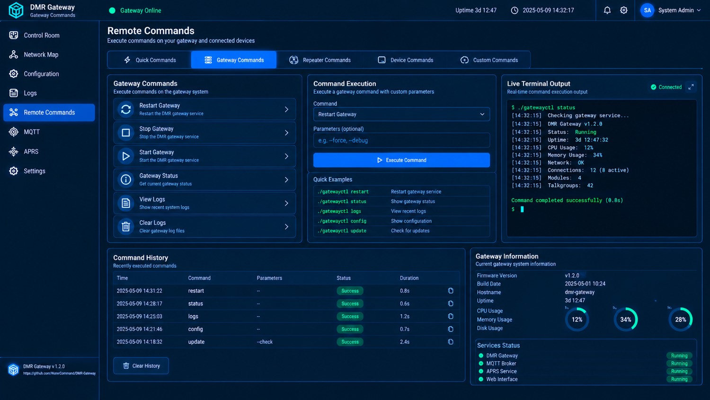

### Gateway Commands List

- Restart Gateway
- Stop Gateway
- Start Gateway
- Gateway Status
- View Logs
- Clear Logs

### Command Execution Panel

- Command dropdown
- Optional parameters field (e.g. `--force`, `--debug`)
- Execute button
- Quick Examples (gatewayctl restart / status / logs / config / update)

### Live Terminal Output

Real-time stdout/stderr from the executed command with colour highlighting for success/error.

### Command History

Time | Command | Parameters | Status | Duration

### Gateway Information Panel

Firmware Version, Build Date, Hostname, Uptime, CPU/Memory/Disk gauges, Services Status (all Running).

---

## 5.10 Remote Commands – Repeater Commands

**Route:** `/remote-commands` (Repeater Commands tab)  
**Purpose:** Per-repeater remote control with command builder and live status.

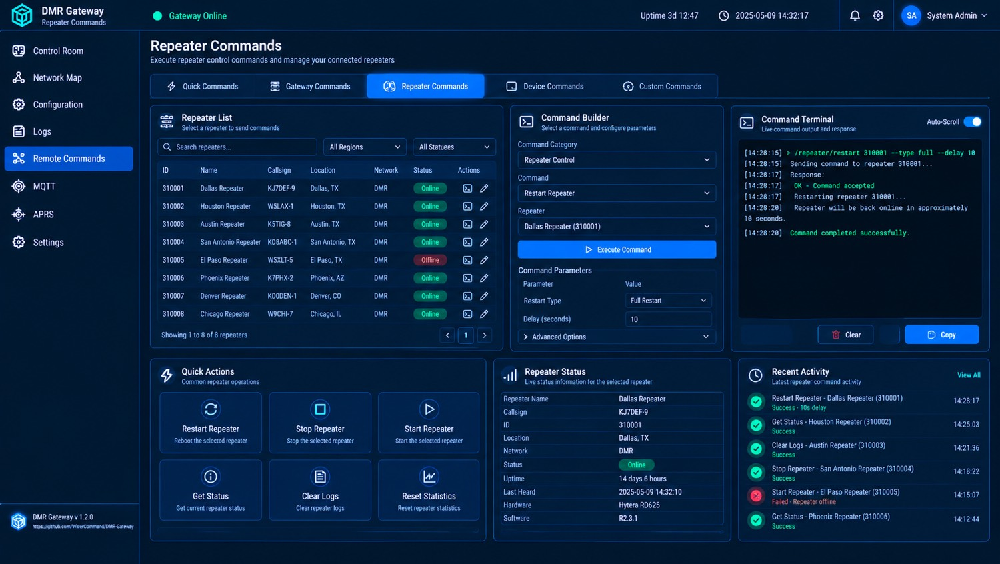

### Repeater List

Scrollable list of all known repeaters with ID, Name, Callsign, Location, Network, Status, and action icons.

### Command Builder

- Command Category (Repeater Control, etc.)
- Command selector (Restart Repeater, Stop, Start, Get Status, Clear Logs, Reset Statistics…)
- Target repeater dropdown
- Parameter fields (Restart Type, Delay, etc.)
- Advanced Options expander
- Execute button

### Command Terminal

Live response pane with auto-scroll, Clear and Copy buttons.

### Quick Actions

Large buttons for Restart / Stop / Start / Get Status / Clear Logs / Reset Statistics.

### Selected Repeater Status

Name, Callsign, ID, Location, Network, Status, Uptime, Last Heard, Hardware, Software.

### Recent Activity

Timeline of recent repeater commands with success/failure indicators.

---

## 5.11 MQTT

**Route:** `/mqtt`  
**Purpose:** Full MQTT client configuration, topic management, live message stream, and connection metrics.

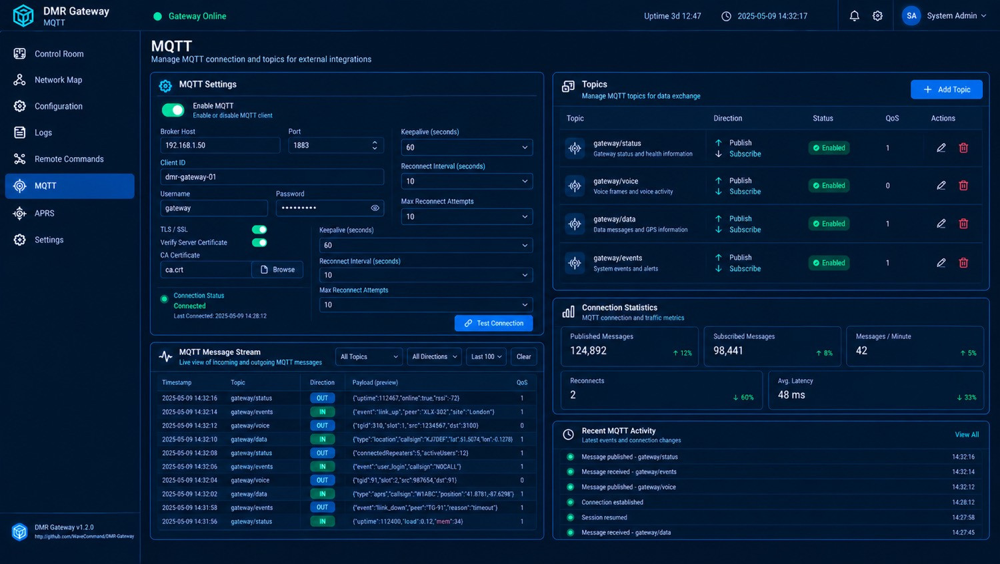

### MQTT Settings

| Setting | Value |
|---------|-------|
| Enable MQTT | On |
| Broker Host | 192.168.1.50 |
| Port | 1883 |
| Client ID | dmr-gateway-01 |
| Username | gateway |
| Password | ******** |
| Keepalive | 60 s |
| Reconnect Interval | 10 s |
| Max Reconnect Attempts | 10 |
| TLS / SSL | On |
| Verify Server Certificate | On |
| CA Certificate | ca.crt |

Connection Status: Connected (Last Connected 2025-05-09 14:28:12)

### Topics Table

| Topic | Direction | Status | QoS |
|-------|-----------|--------|-----|
| gateway/status | Publish + Subscribe | Enabled | 1 |
| gateway/voice | Publish + Subscribe | Enabled | 0 |
| gateway/data | Publish + Subscribe | Enabled | 1 |
| gateway/events | Publish + Subscribe | Enabled | 1 |

### Connection Statistics

- Published Messages: 124,892 (+12%)
- Subscribed Messages: 98,441 (+8%)
- Messages / Minute: 42 (+5%)
- Reconnects: 2 (↓60%)
- Avg. Latency: 48 ms (↓33%)

### MQTT Message Stream

Live table of Timestamp | Topic | Direction (IN/OUT) | Payload (preview) | QoS

### Recent MQTT Activity

Timeline of latest publish/subscribe events and connection changes.

---

## 5.12 APRS

**Route:** `/aprs`  
**Purpose:** APRS station tracking, live map, beacon configuration, and traffic statistics.

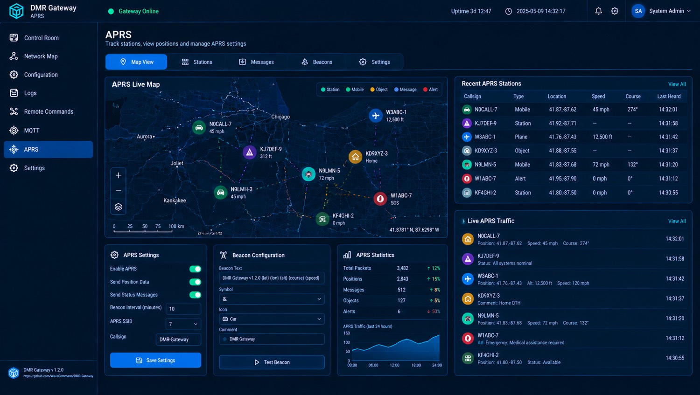

### APRS Live Map

Regional map centred on the Chicago / Illinois area showing:

- Stations (green)
- Mobile stations (car icons)
- Objects (home icons)
- Messages
- Alerts (red)

Visible callsigns: N0CALL-7, KJ7DEF-9, W3ABC-1 (plane), KD9XYZ-3, N9LMN-5, W1ABC-7 (SOS), KF4GHI-2, etc.

### Recent APRS Stations

| Callsign | Type | Location | Speed | Course | Last Heard |
|----------|------|----------|-------|--------|------------|
| N0CALL-7 | Mobile | 41.87,-87.62 | 45 mph | 274° | 14:32:01 |
| KJ7DEF-9 | Station | 41.92,-87.71 | — | — | 14:31:58 |
| W3ABC-1 | Plane | 41.76,-87.43 | — | 12,500 ft | 14:31:42 |
| … | … | … | … | … | … |

### APRS Settings

- Enable APRS: On
- Send Position Data: On
- Send Status Messages: On
- Beacon Interval: 10 minutes
- APRS SSID: 7
- Callsign: DMRGateway

### Beacon Configuration

- Beacon Text: DMR Gateway v1.2.0 (lat) (lon) (alt) (course) (speed)
- Symbol: &
- Icon: Car
- Comment: DMR Gateway

### APRS Statistics

- Total Packets: 3,482 (+12%)
- Positions: 2,843 (+15%)
- Messages: 512 (+8%)
- Objects: 127 (+5%)
- Alerts: 6 (↓50%)

Live traffic graph (last 24 hours).

---

## 5.13 Advanced

**Route:** `/configuration` (Advanced tab) or `/advanced`  
**Purpose:** System-wide advanced configuration, security hardening, service management, user administration, and maintenance operations.

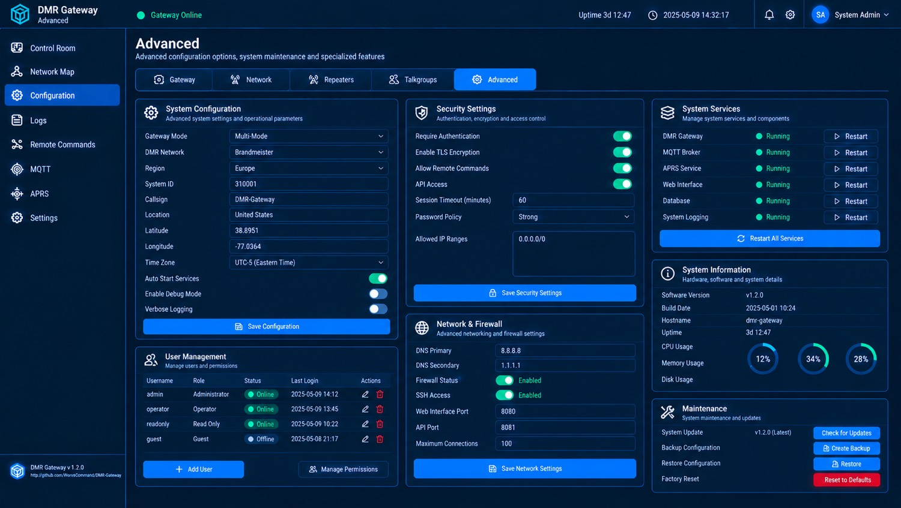

### System Configuration

| Field | Value |
|-------|-------|
| Gateway Mode | Multi-Mode |
| DMR Network | Brandmeister |
| Region | Europe |
| System ID | 310001 |
| Callsign | DMR-Gateway |
| Location | United States |
| Latitude | 38.8951 |
| Longitude | -77.0364 |
| Time Zone | UTC-5 (Eastern Time) |
| Auto Start Services | On |
| Enable Debug Mode | Off |
| Verbose Logging | Off |

### Security Settings

- Require Authentication: On
- Enable TLS Encryption: On
- Allow Remote Commands: On
- API Access: On
- Session Timeout: 60 minutes
- Password Policy: Strong
- Allowed IP Ranges: 0.0.0.0/0

### System Services

| Service | Status | Action |
|---------|--------|--------|
| DMR Gateway | Running | Restart |
| MQTT Broker | Running | Restart |
| APRS Service | Running | Restart |
| Web Interface | Running | Restart |
| Database | Running | Restart |
| System Logging | Running | Restart |

“Restart All Services” button available.

### User Management

| Username | Role | Status | Last Login |
|----------|------|--------|------------|
| admin | Administrator | Online | 2025-05-09 14:12 |
| operator | Operator | Online | 2025-05-09 13:45 |
| readonly | Read Only | Online | 2025-05-09 10:22 |
| guest | Guest | Offline | 2025-05-08 21:17 |

### Network & Firewall

- DNS Primary / Secondary
- Firewall Status
- SSH Access
- Web Interface Port: 8080
- API Port: 8081
- Maximum Connections: 100

### System Information

Software Version, Build Date, Hostname, Uptime, CPU / Memory / Disk gauges.

### Maintenance

- Check for Updates
- Create Backup
- Restore Configuration
- Factory Reset (destructive)

---

## Image Reference Summary

| Screenshot | Filename |
|------------|----------|
| Control Room | `96BBB497-05FB-4712-920F-D1DFF479AB28.jpg` |
| Network Map | `5E866BFF-C345-4947-BBC7-468D7B12CEDB.jpg` |
| Configuration – Gateway | `2E051D24-19CF-41EE-8A08-F66FE07212F9.jpg` |
| Configuration – Network | `EA95425E-6AB7-4D93-B0C0-89991AC6DA92.jpg` |
| Repeaters | `9B6C21CE-ED44-4427-9C54-E847904D0BBB.jpg` |
| Talkgroups | `287F3F21-436C-4467-8DF3-F33860AA6D62.jpg` |
| Logs | `B72FFAC9-73B4-45A0-A78B-DD077ACF733F.jpg` |
| Remote Commands – Quick | `E587E0C8-8DC1-47FE-89DB-42366CDBCCD1.jpg` |
| Remote Commands – Gateway | `9971E139-DD8A-4320-A239-D37A3A3184BC.jpg` |
| Remote Commands – Repeater | `0925E51F-3E45-4DEB-9D67-4D373D9F2090.jpg` |
| MQTT | `84E6B9BC-FA2B-4220-B184-23157A4D94BA.jpg` |
| APRS | `B7D31A68-E23E-4BDA-89A5-887BDA7F1FD0.jpg` |
| Advanced | `54CD4996-A072-4900-97D7-2C1F41A0422A.jpg` |

All images use relative paths and will render correctly on GitHub when placed in the same directory as this Markdown file.

---

# 6. Goals

## Primary Goals

- Multi-backend DMR support.
- Unified event model.
- Rule-based automation.
- Workflow execution.
- DMR SMS support.
- DMR voice/TTS alerts.
- MQTT integration.
- Home Assistant integration.
- GPIO and serial control.
- Cellular SMS bridging.
- Secure Edge Functions.
- Real-time web UI.
- Audit logging.
- Event history.
- Simulation.
- Event replay.
- CLI administration.
- Docker deployment.
- Raspberry Pi compatibility.

## Operational Goals

- Easy installation.
- Safe defaults.
- Clear diagnostics.
- Graceful failure.
- Idempotent actions where possible.
- Reliable queued execution.
- Strong authorization.
- No direct hardware access from user code.

---

# 7. Non-Goals

The project should not initially attempt to become:

- a replacement for professional radio infrastructure;
- a full DMR repeater implementation;
- a generic cloud platform;
- an unrestricted serverless execution platform;
- a full enterprise IAM product;
- a general-purpose PLC;
- a replacement for Home Assistant.

Instead, it should integrate with those systems.

---

# 8. Core Concepts

The platform consists of the following major concepts:

```text
User
Role
Permission

Device
Device Capability

Radio
Talkgroup

Event
Rule
Condition
Workflow
Action
Job
Execution

Alert
Alert Execution

Edge Function
Function Version

Integration
Secret

Audit Entry
```

The relationship is approximately:

```text
Device
  |
  +--> generates Events
  |
  +--> receives Actions

Events
  |
  +--> Rules
          |
          +--> Workflows
                  |
                  +--> Actions
                          |
                          +--> Jobs
                                  |
                                  +--> Executions
```

---

# 9. System Architecture

## 9.1 High-Level Architecture

```text
                           +-----------------------+
                           |      Vue 3 UI         |
                           | Naive UI / Pinia      |
                           +-----------+-----------+
                                       |
                                  REST / WS
                                       |
                           +-----------v-----------+
                           |      Go API/Core      |
                           |                       |
                           | Auth                  |
                           | Devices               |
                           | Rules                 |
                           | Workflows             |
                           | Alerts                |
                           | Events                |
                           | Audit                 |
                           +-----------+-----------+
                                       |
                          +------------+------------+
                          |                         |
                          v                         v
                  +---------------+         +---------------+
                  | Event Bus     |         | Task Queue    |
                  | Redis         |         | Asynq         |
                  +-------+-------+         +-------+-------+
                          |                         |
                          +------------+------------+
                                       |
                              +--------v--------+
                              | Action Engine   |
                              +--------+--------+
                                       |
              +------------------------+-----------------------+
              |            |              |          |         |
              v            v              v          v         v
           DMR           MQTT           GPIO       HTTP      SMS
          Adapter       Adapter        Agent      Adapter   Gateway
              |
       +------+------+ 
       |      |      |
     MMDVM  IPSC   Hytera
```

---

# 10. Trust Boundaries

The architecture deliberately separates components by trust level.

## Trust Zone 1: Core Application

Trusted application code:

```text
backend
worker
database
redis
```

## Trust Zone 2: Hardware

Privileged:

```text
hardware-agent
modem-gateway
DMR adapters
```

## Trust Zone 3: External Systems

Potentially untrusted or unreliable:

```text
HTTP APIs
MQTT clients
cellular networks
camera APIs
Home Assistant
```

## Trust Zone 4: User Code

Highly restricted:

```text
Deno runtime
```

User functions must never receive:

- Docker socket;
- host filesystem;
- unrestricted network;
- database credentials;
- Redis credentials;
- hardware devices;
- arbitrary process execution.

---

# 11. Event-Driven Architecture

The event system is the central architecture.

## 11.1 Event Flow

```text
SOURCE
  |
  v
Adapter
  |
  v
Normalization
  |
  v
Event Bus
  |
  +----> Event Store
  |
  +----> Rules Engine
  |
  +----> WebSocket
  |
  +----> MQTT
  |
  +----> Metrics
```

---

## 11.2 Event Lifecycle

1. Source generates event.
2. Adapter receives event.
3. Adapter validates source data.
4. Adapter normalizes event.
5. Event receives unique ID.
6. Event receives correlation ID.
7. Event is published.
8. Event is persisted.
9. Rules engine evaluates matching rules.
10. Matching rules produce workflow/action executions.
11. Jobs are queued.
12. Workers execute jobs.
13. Results are recorded.
14. UI receives live updates.
15. Audit record is created where applicable.

---

# 12. Event Model

Every event should have a common envelope.

```json
{
  "id": "evt_01J...",
  "type": "dmr.sms.received",
  "version": 1,
  "timestamp": "2026-10-01T01:10:00Z",
  "correlation_id": "corr_01J...",
  "source": {
    "type": "dmr",
    "backend": "mmdvm",
    "device_id": "device_01"
  },
  "subject": {
    "type": "radio",
    "id": "radio_01"
  },
  "payload": {},
  "metadata": {}
}
```

## 12.1 Event Fields

### id

Globally unique event ID.

### type

Namespaced event type.

Examples:

```text
dmr.sms.received
dmr.sms.sent
dmr.ptt.started
dmr.ptt.ended
dmr.voice.started
dmr.voice.ended
dmr.device.connected
dmr.device.disconnected
mqtt.message.received
gpio.changed
serial.received
cellular.sms.received
schedule.triggered
alert.triggered
workflow.started
workflow.completed
workflow.failed
function.started
function.completed
```

### version

Schema version.

### timestamp

UTC timestamp.

### correlation_id

Connects related events and actions.

### source

Identifies the origin.

### subject

Identifies the object affected.

### payload

Event-specific information.

### metadata

Optional adapter-specific or contextual information.

---

# 13. Device Abstraction

Devices are first-class resources.

```go
type Device struct {
    ID           uuid.UUID
    Name         string
    Type         string
    Driver       string
    Address      string
    Enabled      bool
    Config       json.RawMessage
    LastSeen     *time.Time
    CreatedAt    time.Time
    UpdatedAt    time.Time
}
```

Possible device types:

```text
mmdvm
ipsc
hytera
gpio
serial
modem
mqtt
camera
http
```

---

## 13.1 Device Capabilities

Devices advertise capabilities.

Examples:

```text
dmr.voice.receive
dmr.voice.transmit
dmr.sms.receive
dmr.sms.transmit
dmr.ptt.receive
dmr.status
gpio.read
gpio.write
serial.read
serial.write
sms.receive
sms.send
```

This allows the UI and action engine to determine what a device can actually do.

---

# 14. DMR Backend Architecture

All DMR implementations should expose a common adapter interface.

Conceptually:

```go
type DMRBackend interface {
    ID() string
    Connect(ctx context.Context) error
    Close() error
    Health(ctx context.Context) error

    Events() <-chan DMRRawEvent

    SendSMS(ctx context.Context, req SendSMSRequest) error
    BroadcastAudio(ctx context.Context, req BroadcastAudioRequest) error
}
```

The exact interface may evolve as backend capabilities are established.

The important requirement is that the core application must not depend on a specific DMR implementation.

---

# 15. MMDVM Integration

MMDVM is the primary initial RF backend.

The adapter should:

- receive radio activity;
- normalize PTT events;
- normalize voice lifecycle;
- receive DMR SMS where supported;
- transmit DMR SMS;
- transmit audio where supported;
- expose device health;
- expose backend diagnostics.

The MMDVM implementation should live behind the common DMR adapter.

Example:

```text
MMDVM
  |
  v
MMDVM Adapter
  |
  v
DMR Event Normalizer
  |
  v
Event Bus
```

The exact wire protocol and supported operations should be isolated inside the adapter.

---

# 16. Motorola IPSC Integration

Motorola IPSC support should be implemented as a separate adapter or bridge.

The bridge should translate proprietary/network-specific behavior into the normalized event model.

```text
Motorola Network
      |
      v
IPSC Bridge
      |
      v
Normalized DMR Events
      |
      v
Core Event Bus
```

The rest of the application must not need to know that an event originated from IPSC.

---

# 17. Hytera Integration

Hytera support should follow the same pattern.

```text
Hytera
   |
   v
Hytera Bridge
   |
   v
Normalized DMR Events
   |
   v
Core
```

The bridge should isolate:

- network protocol;
- authentication;
- proprietary packet formats;
- connection lifecycle;
- device-specific behavior.

---

# 18. Rules Engine

The rules engine converts events into automation.

A rule has:

```text
Trigger
Conditions
Actions / Workflow
Permissions
Rate Limits
Cooldown
Enabled State
Version
```

Example conceptual rule:

```yaml
name: Front Door Unlock

trigger:
  event: dmr.sms.received

conditions:
  - field: radio.talkgroup
    operator: equals
    value: 9001

  - field: radio.src_id
    operator: in
    value:
      - 1234567
      - 7654321

  - field: payload.text
    operator: matches
    value: "^UNLOCK [0-9]{4}$"

actions:
  - type: verify_pin
  - type: hikvision.unlock
    target: front-door
  - type: dmr.send_sms
    message: "Front door unlocked"

security:
  rate_limit:
    max: 3
    window: 60s
```

---

# 19. Conditions

Conditions should be composable.

Supported operators:

```text
equals
not_equals
contains
starts_with
ends_with
matches
in
not_in
greater_than
less_than
greater_or_equal
less_or_equal
exists
not_exists
```

Logical groups:

```text
AND
OR
NOT
```

Example:

```yaml
conditions:
  all:
    - field: radio.talkgroup
      equals: 9001

    - any:
        - field: radio.src_id
          equals: 1234567
        - field: radio.src_id
          equals: 7654321

    - field: payload.text
      matches: "^UNLOCK"
```

---

# 20. Actions

Actions are executable units.

Initial actions:

```text
dmr.send_sms
dmr.broadcast_audio
dmr.trigger_alert

mqtt.publish

gpio.set
gpio.pulse

serial.write

http.request

hikvision.unlock

sms.send

function.execute

delay
condition
sequence
parallel
```

Every action should support:

- validation;
- timeout;
- authorization;
- retry policy;
- dry-run where practical;
- structured result;
- audit information.

---

## 20.1 Action Interface

Conceptually:

```go
type Action interface {
    Type() string

    Validate(config map[string]any) error

    Execute(
        ctx context.Context,
        input ActionInput,
    ) (ActionResult, error)
}
```

---

# 21. Workflows

A workflow combines multiple actions.

Example:

```yaml
name: Doorbell Notification

steps:
  - id: mqtt
    action: mqtt.publish

  - id: radio
    action: dmr.broadcast_audio

  - id: wait
    action: delay
    config:
      duration: 10s

  - id: cellular
    action: sms.send
```

Workflows should support:

- sequential execution;
- parallel execution;
- conditional branches;
- delays;
- retries;
- timeouts;
- failure handling;
- compensation actions where appropriate;
- execution history.

---

## 21.1 Workflow Example

```text
Doorbell
   |
   +----> MQTT
   |
   +----> DMR announcement
   |
   +----> Wait 10 seconds
             |
             +----> If not acknowledged
                        |
                        +----> Cellular SMS
```

---

# 22. Task and Job System

Asynq should execute asynchronous work.

Examples:

```text
alert:trigger
tts:generate
dmr:audio_broadcast
dmr:sms_send
sms:cellular_send
mqtt:publish
action:gpio
action:serial
action:http
action:hikvision
function:execute
workflow:execute
```

Each job should have:

```text
job ID
type
payload
priority
attempt count
maximum attempts
created timestamp
started timestamp
completed timestamp
correlation ID
```

---

# 23. Alert System

Alerts are reusable definitions.

```go
type Alert struct {
    ID            uuid.UUID
    Name          string
    Type          string
    Text          string
    VoiceID       string
    TalkGroupID   uuid.UUID
    Enabled       bool
    LastTriggered *time.Time
    CreatedAt     time.Time
    UpdatedAt     time.Time
}
```

Alert types:

```text
tts
message
```

Potential future types:

```text
audio
workflow
multichannel
```

---

## 23.1 Alert Trigger

Endpoint:

```http
POST /api/alerts/{id}/trigger
```

The trigger should:

1. Authenticate request.
2. Authorize trigger permission.
3. Rate-limit request.
4. Validate alert state.
5. Create execution record.
6. Queue work.
7. Return execution ID.

The HTTP request should not wait for the entire radio transmission.

---

# 24. DMR Command System

Command talkgroups are dedicated channels for automation.

Example:

```text
9001 = DOORBELL
9002 = UNLOCK_FRONT
9003 = OPEN_GATE
9004 = SITE_ALARM
```

Commands can originate from:

```text
PTT
DMR SMS
```

A command must pass:

```text
Identity
Authorization
Rule matching
Rate limiting
Replay protection
Action authorization
```

---

# 25. Radio Identity and Authorization

Radio IDs should be represented as first-class entities.

Example:

```go
type Radio struct {
    ID          uuid.UUID
    DMRID       uint32
    Name        string
    Description string
    Enabled     bool
    CreatedAt   time.Time
    UpdatedAt   time.Time
}
```

Optional group membership:

```text
Security
Maintenance
Operators
Guests
Emergency
```

Permissions can then be assigned to groups.

---

## 25.1 Example

```text
Radio 1234567
    |
    v
Security Group
    |
    +----> unlock.front
    +----> gate.open
    +----> alarm.ack
```

A guest radio may have:

```text
dmr.receive
dmr.send
```

but not:

```text
door.unlock
gate.open
```

---

# 26. TTS Architecture

ElevenLabs is the initial TTS provider.

The TTS service should:

1. Accept text and voice configuration.
2. Calculate deterministic cache key.
3. Check cache.
4. Generate audio if missing.
5. Validate returned audio.
6. Store cached audio.
7. Return audio reference.
8. Queue DMR broadcast.

Cache key should include relevant synthesis parameters.

Example:

```text
SHA256(
    provider
    voice_id
    model
    text
    settings
)
```

This prevents duplicate API requests for identical audio.

---

# 27. MQTT and Home Assistant

MQTT is the primary automation integration.

Example event topics:

```text
dmr/events/sms_received
dmr/events/ptt_started
dmr/events/ptt_ended
dmr/events/voice_started
dmr/events/voice_ended
dmr/events/status
dmr/events/alert
```

Command topics:

```text
dmr/commands/alert
dmr/commands/send_sms
dmr/commands/broadcast
```

---

## 27.1 Home Assistant

Future support should include MQTT Discovery.

Potential entities:

```text
DMR Gateway online status
RF backend status
Last radio activity
Last talkgroup
Active alert
Connected modem
```

Buttons could trigger:

```text
Doorbell announcement
Site alarm
Maintenance announcement
```

---

# 28. Cellular SMS Gateway

Cellular SMS is an optional integration.

Architecture:

```text
DMR
 |
 v
Gateway
 |
 v
SMS Router
 |
 v
Modem / API Provider
 |
 v
Cellular Network
```

Inbound:

```text
Cellular SMS
 |
 v
Modem
 |
 v
Gateway
 |
 v
Normalized Event
 |
 v
Rule Engine
 |
 v
DMR SMS
```

Mapping should support:

```text
phone number -> talkgroup
phone number -> radio ID
phone number -> rule
```

---

# 29. Hardware Agent

The hardware agent is a privileged service.

It should provide controlled APIs for:

```text
GPIO
Serial
Modem
Other local devices
```

It must not expose arbitrary host command execution.

Example API:

```text
gpio.set
gpio.get
gpio.pulse

serial.list
serial.open
serial.write
serial.read
```

The backend should communicate with the hardware agent through authenticated local networking.

---

# 30. Edge Functions

Edge Functions provide user-defined automation.

Runtime:

```text
Deno
TypeScript
```

Functions should be short-lived and restricted.

Example:

```typescript
export default async function handler(event) {
    if (event.type === "dmr.sms.received") {
        await dmr.sendSms(
            event.radio.talkgroup,
            "Command received"
        );
    }
}
```

---

## 30.1 Function Security

Functions must have:

- CPU limit;
- memory limit;
- execution timeout;
- restricted filesystem;
- restricted network;
- no host device access;
- no Docker socket;
- no arbitrary process execution;
- explicit SDK permissions.

---

## 30.2 Function Permissions

Example:

```json
{
  "permissions": [
    "dmr.send_sms",
    "mqtt.publish"
  ]
}
```

A function lacking:

```text
hardware.gpio
```

must not be able to invoke GPIO.

---

# 31. Secrets Management

Sensitive credentials should be represented as secrets.

Examples:

```text
ElevenLabs API key
MQTT password
Camera password
Cellular provider credentials
DMR backend credentials
```

Secrets should:

- be encrypted at rest;
- never appear in normal API responses;
- never appear in logs;
- be masked in UI;
- be injected only into authorized processes;
- support rotation.

---

# 32. Authentication and Authorization

Initial authentication:

```text
Email
Password
JWT
```

Password storage:

```text
bcrypt
```

Potential future authentication:

```text
WebAuthn
Passkeys
OIDC
LDAP
```

---

## 32.1 Permissions

Instead of relying exclusively on roles, permissions should be granular.

Examples:

```text
alerts.read
alerts.write
alerts.trigger

talkgroups.read
talkgroups.write

devices.read
devices.write

rules.read
rules.write
rules.execute

workflows.read
workflows.write
workflows.execute

functions.read
functions.write
functions.execute

users.read
users.write

system.admin
audit.read
```

Roles can then be bundles of permissions.

---

# 33. Security Architecture

Security requirements:

- strong password hashing;
- secure JWT handling;
- short-lived access tokens;
- refresh token rotation where implemented;
- CSRF protection where applicable;
- rate limiting;
- input validation;
- audit logging;
- strict authorization;
- secure secrets storage;
- network segmentation;
- least privilege;
- sandboxed user code;
- no unnecessary privileged containers.

---

## 33.1 Sensitive Actions

Actions such as:

```text
door.unlock
gate.open
alarm.disable
```

should support additional policies:

```text
authorized radio
PIN
time window
cooldown
rate limit
confirmation
audit requirement
```

---

# 34. Audit Logging

Audit entries should contain:

```json
{
  "id": "audit_01",
  "timestamp": "2026-10-01T01:30:00Z",
  "actor_type": "radio",
  "actor_id": "1234567",
  "event": "door.unlock",
  "rule_id": "rule_01",
  "rule_version": 7,
  "action": "hikvision.unlock",
  "target": "front-door",
  "result": "success",
  "correlation_id": "corr_01"
}
```

Audit logs should be append-oriented and difficult for ordinary operators to modify.

---

# 35. Observability

The system should expose:

```text
Health
Metrics
Logs
Events
Executions
Audit
```

Prometheus-compatible metrics should be considered.

Examples:

```text
dmr_events_total
dmr_sms_total
dmr_voice_sessions_total
dmr_commands_total
dmr_command_failures_total

automation_executions_total
automation_execution_duration_seconds

tts_requests_total
tts_cache_hits_total

function_executions_total
function_execution_failures_total
```

---

# 36. Event Explorer

The UI should provide a real-time event explorer.

Example:

```text
01:32:14  MMDVM
          TG 9001 / TS1
          Radio 1234567
          PTT START

01:32:18  MMDVM
          TG 9001 / TS1
          VOICE END
          Duration: 4.2s

01:32:21  COMMAND
          "UNLOCK 4921"
          Rule: Front Door Unlock
          Authorization: PASS

01:32:21  HARDWARE
          GPIO 17 -> HIGH

01:32:22  DMR
          SMS -> 1234567
          "Front door unlocked"
```

Filters should include:

```text
time range
event type
device
backend
talkgroup
radio
rule
workflow
result
correlation ID
```

---

# 37. Simulation and Dry-Run

The system should include a simulator.

Example CLI:

```bash
dmrctl simulate sms \
  --src 1234567 \
  --tg 9001 \
  --text "UNLOCK 1234"
```

PTT:

```bash
dmrctl simulate ptt \
  --src 1234567 \
  --tg 9002
```

Dry-run should show:

```text
EVENT
  dmr.sms.received

MATCHED RULE
  Front Door Unlock v7

CONDITIONS
  PASS
  PASS
  PASS

ACTIONS

  [DRY RUN]
  hikvision.unlock(front-door)

  [DRY RUN]
  dmr.send_sms(...)
```

No physical action should occur.

---

# 38. Event Replay

Persisted events should be replayable.

Replay modes:

```text
inspect
dry-run
test-rule
test-workflow
```

Example:

```text
Event #183829
|
+-- Original Rule v4
|
+-- Replay using Rule v7
|
+-- Dry-run actions
```

This allows operators to test changes against historical events.

---

# 39. Web Application

Frontend:

```text
Vue 3
TypeScript
Vite
Naive UI
Pinia
VueUse
Monaco Editor
VeeValidate
Zod
```

Main views:

```text
Dashboard
Events
Devices
Radios
Talkgroups
Alerts
Rules
Workflows
Jobs
Functions
Integrations
Audit
Users
System
Settings
```

---

## 39.1 Dashboard

The dashboard should show:

```text
System Health
RF Backends
Recent Radio Activity
Active Jobs
Recent Automation
Alerts
Errors
MQTT Status
Modem Status
```

---

## 39.2 Rule Builder

Two modes should eventually exist.

### Visual Mode

Form-based rule creation.

### Advanced Mode

YAML/JSON editor.

The system should validate the rule before saving.

---

# 40. CLI

A CLI should complement the web UI.

Examples:

```bash
dmrctl status

dmrctl devices list

dmrctl radios list

dmrctl talkgroups list

dmrctl alerts list

dmrctl alerts trigger doorbell

dmrctl events tail

dmrctl events inspect <id>

dmrctl rules list

dmrctl rules test <id>

dmrctl workflows run <id>

dmrctl functions list

dmrctl functions invoke <id>

dmrctl audit tail

dmrctl simulate sms ...
```

---

# 41. Database Model

PostgreSQL is the primary database.

Core entities:

```text
users
roles
permissions
user_roles
role_permissions

devices
device_capabilities

radios
radio_groups
radio_group_members

talkgroups

alerts
alert_executions

rules
rule_versions
rule_executions

workflows
workflow_versions
workflow_executions

actions
jobs
job_executions

events
audit_logs

edge_functions
edge_function_versions

integrations
secrets

api_tokens
refresh_tokens
```

---

## 41.1 Event Storage

Events should be append-oriented.

Recommended fields:

```text
id
type
version
timestamp
correlation_id
source_type
source_id
subject_type
subject_id
payload
metadata
created_at
```

Indexes should exist for:

```text
timestamp
type
correlation_id
source_id
subject_id
```

---

# 42. API Design

Base path:

```text
/api
```

Authentication:

```text
POST /api/auth/login
POST /api/auth/logout
GET  /api/auth/me
```

Devices:

```text
GET    /api/devices
POST   /api/devices
GET    /api/devices/{id}
PUT    /api/devices/{id}
DELETE /api/devices/{id}
POST   /api/devices/{id}/test
```

Talkgroups:

```text
GET    /api/talkgroups
POST   /api/talkgroups
GET    /api/talkgroups/{id}
PUT    /api/talkgroups/{id}
DELETE /api/talkgroups/{id}
```

Alerts:

```text
GET    /api/alerts
POST   /api/alerts
GET    /api/alerts/{id}
PUT    /api/alerts/{id}
DELETE /api/alerts/{id}
POST   /api/alerts/{id}/trigger
```

Rules:

```text
GET    /api/rules
POST   /api/rules
GET    /api/rules/{id}
PUT    /api/rules/{id}
DELETE /api/rules/{id}
POST   /api/rules/{id}/test
GET    /api/rules/{id}/versions
```

Workflows:

```text
GET    /api/workflows
POST   /api/workflows
GET    /api/workflows/{id}
PUT    /api/workflows/{id}
DELETE /api/workflows/{id}
POST   /api/workflows/{id}/execute
POST   /api/workflows/{id}/dry-run
```

Events:

```text
GET /api/events
GET /api/events/{id}
POST /api/events/replay
```

Functions:

```text
GET    /api/functions
POST   /api/functions
GET    /api/functions/{id}
PUT    /api/functions/{id}
DELETE /api/functions/{id}
POST   /api/functions/{id}/execute
GET    /api/functions/{id}/versions
```

Audit:

```text
GET /api/audit
GET /api/audit/{id}
```

System:

```text
GET /api/system/health
GET /api/system/status
GET /api/system/metrics
```

---

# 43. WebSocket Design

Endpoint:

```text
/ws
```

The server should publish structured messages.

Example:

```json
{
  "type": "event.created",
  "data": {
    "event_id": "evt_01"
  }
}
```

Other messages:

```text
device.status
dmr.activity
alert.started
alert.completed
job.started
job.completed
workflow.started
workflow.completed
function.log
system.status
```

Clients should be able to subscribe to channels.

Example:

```json
{
  "action": "subscribe",
  "channels": [
    "dmr.activity",
    "jobs",
    "system"
  ]
}
```

---

# 44. Internal Service Contracts

Services should communicate using explicit contracts.

Preferred patterns:

```text
HTTP/gRPC for request/response
Redis event bus for events
Asynq for durable jobs
MQTT for external automation
```

Avoid direct database access from unrelated services.

For example:

```text
hardware-agent
```

should not query the application database directly.

---

# 45. Configuration

Configuration should support environment variables.

Example:

```env
APP_ENV=production
APP_LOG_LEVEL=info

HTTP_ADDR=:8080

DATABASE_URL=postgres://...
REDIS_URL=redis://...

JWT_SECRET=...

MQTT_URL=mqtt://mqtt:1883

ELEVENLABS_API_KEY=...

FUNCTION_RUNTIME_URL=http://deno-runtime:8090
HARDWARE_AGENT_URL=http://hardware-agent:8090
```

Sensitive values should eventually migrate to the secrets subsystem.

---

# 46. Docker Architecture

Initial mandatory services:

```text
frontend
backend
task-worker
postgres
redis
mqtt
```

Optional services:

```text
mmdvm
ipsc-bridge
hytera-bridge
hardware-agent
deno-runtime
modem-gateway
```

The default installation should not require all optional integrations.

---

# 47. Networking

Use separate Docker networks where useful.

Example:

```text
frontend-network
backend-network
integration-network
hardware-network
```

The database should not be publicly exposed.

Redis should not be publicly exposed.

MQTT authentication should be enabled for non-local deployments.

The hardware agent should only be reachable by authorized application services.

---

# 48. Persistence

Persistent data:

```text
PostgreSQL
Redis
TTS cache
Function source
MQTT configuration
Application configuration
```

TTS cache can use:

```text
Docker volume
```

or an object-storage abstraction in future versions.

---

# 49. Reliability

The system should prefer asynchronous execution.

A trigger endpoint should return:

```json
{
  "execution_id": "exec_01",
  "status": "queued"
}
```

rather than waiting for:

```text
TTS
RF transmission
SMS
camera action
```

to finish.

---

## 49.1 Idempotency

External triggers should support idempotency keys where practical.

Example:

```http
Idempotency-Key: 8c0c...
```

This prevents duplicate execution when clients retry requests.

---

# 50. Failure Handling

Actions should return structured results.

```json
{
  "status": "failed",
  "error_code": "DEVICE_OFFLINE",
  "message": "Front door controller unavailable"
}
```

Failures should be categorized:

```text
VALIDATION_ERROR
AUTHORIZATION_ERROR
DEVICE_OFFLINE
TIMEOUT
RATE_LIMITED
NETWORK_ERROR
PROVIDER_ERROR
INTERNAL_ERROR
```

---

# 51. Rate Limiting

Rate limits should exist at multiple levels.

## API

Per:

```text
IP
user
token
endpoint
```

## DMR

Per:

```text
radio
talkgroup
command
```

## Automation

Per:

```text
rule
action
target
```

Example:

```text
Unlock:
maximum 3 executions per minute
```

---

# 52. Validation

Validation must happen at boundaries.

Examples:

```text
API request
MQTT message
DMR message
Rule configuration
Workflow configuration
Function configuration
Device configuration
```

Use strict schemas.

Never assume external input is valid.

---

# 53. Testing Strategy

Testing should occur at several levels.

## Unit Tests

Test:

```text
rule evaluation
conditions
authorization
action validation
event normalization
configuration
```

## Integration Tests

Test:

```text
Postgres
Redis
MQTT
Asynq
HTTP APIs
```

## Adapter Tests

Use simulated RF inputs.

## End-to-End Tests

Example:

```text
Simulated DMR SMS
    |
    v
Event
    |
    v
Rule
    |
    v
Workflow
    |
    v
Simulated GPIO
    |
    v
Audit
```

---

# 54. Developer Experience

The repository should provide:

```bash
make dev
make test
make lint
make fmt
make migrate
make seed
make build
make docker
```

Local development should require as few external dependencies as possible.

A developer should be able to start the platform with:

```bash
docker compose up
```

and run the frontend/backend locally if desired.

---

# 55. Repository Structure

Recommended structure:

```text
dmr-gateway/
├── README.md
├── LICENSE
├── CONTRIBUTING.md
├── SECURITY.md
├── CHANGELOG.md
├── Makefile
├── docker-compose.yml
├── docker-compose.dev.yml
├── .env.example
├── .gitignore
│
├── backend/
│   ├── cmd/
│   │   ├── api/
│   │   └── worker/
│   │
│   ├── internal/
│   │   ├── domain/
│   │   │   ├── event/
│   │   │   ├── device/
│   │   │   ├── radio/
│   │   │   ├── talkgroup/
│   │   │   ├── alert/
│   │   │   ├── rule/
│   │   │   ├── workflow/
│   │   │   ├── action/
│   │   │   └── function/
│   │   │
│   │   ├── application/
│   │   │   ├── events/
│   │   │   ├── automation/
│   │   │   ├── alerts/
│   │   │   └── commands/
│   │   │
│   │   ├── adapters/
│   │   │   ├── dmr/
│   │   │   │   ├── mmdvm/
│   │   │   │   ├── ipsc/
│   │   │   │   └── hytera/
│   │   │   ├── mqtt/
│   │   │   ├── gpio/
│   │   │   ├── serial/
│   │   │   ├── sms/
│   │   │   └── http/
│   │   │
│   │   ├── infrastructure/
│   │   │   ├── postgres/
│   │   │   ├── redis/
│   │   │   ├── docker/
│   │   │   └── logging/
│   │   │
│   │   └── interfaces/
│   │       ├── http/
│   │       └── websocket/
│   │
│   ├── migrations/
│   ├── go.mod
│   ├── go.sum
│   └── Dockerfile
│
├── frontend/
│   ├── src/
│   │   ├── components/
│   │   ├── layouts/
│   │   ├── views/
│   │   ├── stores/
│   │   ├── services/
│   │   ├── types/
│   │   └── router/
│   ├── package.json
│   └── Dockerfile
│
├── hardware-agent/
│   ├── cmd/
│   ├── internal/
│   ├── Dockerfile
│   └── go.mod
│
├── hytera-bridge/
├── ipsc-bridge/
├── modem-gateway/
│
├── deno-runtime/
│   ├── runtime/
│   ├── sdk/
│   └── Dockerfile
│
├── mosquitto/
│   └── config/
│
├── docs/
│   ├── architecture/
│   ├── api/
│   ├── events/
│   ├── rules/
│   ├── workflows/
│   ├── integrations/
│   └── operations/
│
└── scripts/
    ├── dev/
    ├── test/
    └── release/
```

---

# 56. Technology Stack

## Backend

| Purpose | Technology |
|---|---|
| Language | Go |
| HTTP | chi |
| ORM | GORM |
| Database | PostgreSQL |
| Queue | Asynq |
| Cache/Event Bus | Redis |
| MQTT | Eclipse Paho |
| WebSocket | gorilla/websocket |
| Authentication | JWT |
| Password Hashing | bcrypt |
| Configuration | Viper |
| Validation | go-playground/validator |
| Logging | zerolog |
| Docker | Docker SDK |
| Serial | go.bug.st/serial |

## Frontend

| Purpose | Technology |
|---|---|
| Framework | Vue 3 |
| Language | TypeScript |
| Build | Vite |
| UI | Naive UI |
| State | Pinia |
| Utilities | VueUse |
| Editor | Monaco |
| Validation | Zod |
| Forms | VeeValidate |

## Infrastructure

```text
Docker
Docker Compose
PostgreSQL 16
Redis
Eclipse Mosquitto
Deno
```

---

# 57. Development Phases

## Phase 1 — Core Platform

Build:

- repository;
- Docker Compose;
- PostgreSQL;
- Redis;
- MQTT;
- Go API;
- authentication;
- users;
- devices;
- talkgroups;
- event model;
- WebSocket;
- basic Vue dashboard.

Deliverable:

```text
Platform boots
User can log in
Events can be created
Events appear live in UI
```

---

## Phase 2 — MMDVM

Build:

- MMDVM adapter;
- DMR event normalization;
- DMR SMS;
- outbound audio;
- device health.

Deliverable:

```text
Real DMR event
 -> Event Bus
 -> UI
```

---

## Phase 3 — Rules and Commands

Build:

- rule model;
- conditions;
- command authorization;
- action engine;
- job queue;
- audit logging.

Deliverable:

```text
DMR SMS
 -> rule
 -> simulated action
```

---

## Phase 4 — Hardware Agent

Build:

- GPIO;
- serial;
- device registration;
- health;
- safe action execution.

Deliverable:

```text
DMR command
 -> rule
 -> GPIO
```

---

## Phase 5 — MQTT / Home Assistant

Build:

- MQTT event publisher;
- MQTT command subscriber;
- discovery;
- integration management.

Deliverable:

```text
HA -> MQTT -> Gateway -> DMR
```

---

## Phase 6 — Alerts and TTS

Build:

- ElevenLabs integration;
- cache;
- alert execution;
- TTS broadcast.

Deliverable:

```text
HTTP
 -> Alert
 -> TTS
 -> DMR
```

---

## Phase 7 — Additional RF Backends

Build:

- Hytera bridge;
- Motorola IPSC bridge;
- capability discovery.

Deliverable:

```text
Multiple RF systems
       |
       v
Same event model
```

---

## Phase 8 — Cellular SMS

Build:

- modem adapter;
- SMS routing;
- inbound/outbound bridge;
- mapping rules.

---

## Phase 9 — Edge Functions

Build:

- Deno runtime;
- SDK;
- permission model;
- function versions;
- logs;
- sandboxing.

---

## Phase 10 — Production Hardening

Build:

- metrics;
- advanced audit;
- event replay;
- simulation;
- backup;
- recovery;
- security review;
- documentation;
- upgrade tooling.

---

# 58. Milestones

## M1 — Bootable

```text
docker compose up
```

works.

## M2 — Authenticated

Users can authenticate.

## M3 — Event System

Events can be created and streamed.

## M4 — First RF Backend

MMDVM events work.

## M5 — First Automation

A DMR message can trigger a simulated action.

## M6 — Real Hardware

GPIO action works through hardware-agent.

## M7 — Home Automation

MQTT integration works.

## M8 — TTS

Voice alert works.

## M9 — Multi-RF

Hytera/IPSC adapters work.

## M10 — Extensible Automation

Edge Functions work safely.

---

# 59. Operational Runbook

Operators should be able to answer:

### Is the gateway running?

```bash
docker compose ps
```

### Is the backend healthy?

```text
GET /api/system/health
```

### Is the RF backend connected?

Dashboard:

```text
Devices -> RF Backend -> Health
```

### Why did an automation fail?

Use:

```text
Events
 -> Correlation ID
 -> Rule Execution
 -> Workflow Execution
 -> Job
 -> Action
```

### Why didn't a rule trigger?

Use Rule Tester:

```text
event
 -> conditions
 -> authorization
 -> rate limit
```

---

# 60. Backup and Recovery

PostgreSQL is the primary source of configuration and historical data.

Backups should include:

```text
PostgreSQL
Function source
Configuration
Secrets metadata
MQTT configuration
```

TTS audio may be treated as rebuildable cache data.

Recommended backup types:

```text
daily database backup
weekly full backup
manual pre-upgrade backup
```

Restore should be tested periodically.

---

# 61. Upgrade Strategy

Version the application using semantic versioning.

```text
MAJOR.MINOR.PATCH
```

Database migrations must be forward-only and versioned.

Before upgrades:

```text
backup
stop risky automations
upgrade
migrate
health check
resume
```

The system should expose:

```text
application version
database migration version
frontend version
```

---

# 62. Performance Targets

These are initial engineering targets rather than hard guarantees.

## Event ingestion

Target:

```text
<100 ms
```

for local event normalization and publication under normal load.

## Rule evaluation

Target:

```text
<50 ms
```

for ordinary rule evaluation excluding external I/O.

## API

Target:

```text
p95 < 250 ms
```

for ordinary local CRUD requests.

## WebSocket

Events should appear in connected clients within approximately:

```text
<500 ms
```

under normal local operation.

External RF, TTS, MQTT, camera and cellular latency is outside the core application latency target.

---

# 63. Future Features

Potential future capabilities:

## Multi-Tenancy

Separate:

```text
organizations
sites
users
devices
rules
```

## Native Home Assistant Integration

A custom integration could expose:

```text
events
buttons
sensors
switches
diagnostics
```

## Mobile Application

Potential functions:

```text
alerts
events
acknowledgement
system health
remote administration
```

## Analytics

Examples:

```text
talkgroup activity
radio activity
alert frequency
automation failures
RF uptime
SMS volume
```

## Advanced Workflow Editor

A visual node-based editor could resemble:

```text
Trigger
   |
Condition
   |
 ┌─┴─┐
Yes No
 |   |
Action
 |
Parallel
 / \
A   B
 \ /
  C
```

---

# 64. Example Automations

## 64.1 Doorbell

```text
GPIO doorbell
    |
    v
gpio.changed
    |
    v
Rule
    |
    +----> DMR TTS
    |
    +----> MQTT
    |
    +----> Cellular SMS
```

---

## 64.2 Front Door

```text
DMR SMS
"UNLOCK 1234"
    |
    v
Check Talkgroup
    |
    v
Check Radio
    |
    v
Validate PIN
    |
    v
Rate Limit
    |
    v
Unlock
    |
    +----> Confirmation SMS
    |
    +----> MQTT
    |
    +----> Audit
```

---

## 64.3 Site Alarm

```text
Alarm input
    |
    v
GPIO event
    |
    v
Workflow
    |
    +----> DMR announcement
    |
    +----> DMR SMS
    |
    +----> Cellular SMS
    |
    +----> MQTT
    |
    +----> HTTP webhook
```

---

## 64.4 Scheduled Announcement

```text
08:00
 |
 v
Schedule Event
 |
 v
Alert
 |
 v
TTS
 |
 v
DMR Broadcast
```

---

## 64.5 Radio PTT Trigger

```text
PTT on TG 9002
    |
    v
Rule
    |
    +----> GPIO pulse
    |
    +----> MQTT event
    |
    +----> Confirmation
```

---

# 65. Example API Requests

## Trigger Alert

```http
POST /api/alerts/alert_123/trigger
Authorization: Bearer <token>
Idempotency-Key: 7f5c...
Content-Type: application/json
```

Response:

```json
{
  "execution_id": "exec_123",
  "status": "queued"
}
```

---

## Send DMR SMS

Conceptual internal request:

```json
{
  "talkgroup": 9001,
  "message": "Front door unlocked",
  "source": "automation"
}
```

---

## Create Rule

```json
{
  "name": "Front Door Unlock",
  "enabled": true,
  "trigger": {
    "event": "dmr.sms.received"
  },
  "conditions": {
    "all": [
      {
        "field": "radio.talkgroup",
        "operator": "equals",
        "value": 9001
      },
      {
        "field": "payload.text",
        "operator": "matches",
        "value": "^UNLOCK [0-9]{4}$"
      }
    ]
  }
}
```

---

# 66. Example Event Payloads

## DMR SMS

```json
{
  "id": "evt_01",
  "type": "dmr.sms.received",
  "version": 1,
  "timestamp": "2026-10-01T01:10:00Z",
  "correlation_id": "corr_01",
  "source": {
    "type": "dmr",
    "backend": "mmdvm",
    "device_id": "mmdvm_01"
  },
  "subject": {
    "type": "radio",
    "id": "radio_123"
  },
  "payload": {
    "src_id": 1234567,
    "dst_id": 9001,
    "talkgroup": 9001,
    "slot": 1,
    "text": "UNLOCK 1234"
  }
}
```

---

## PTT Start

```json
{
  "id": "evt_02",
  "type": "dmr.ptt.started",
  "version": 1,
  "timestamp": "2026-10-01T01:11:00Z",
  "correlation_id": "corr_02",
  "source": {
    "type": "dmr",
    "backend": "mmdvm",
    "device_id": "mmdvm_01"
  },
  "payload": {
    "src_id": 1234567,
    "talkgroup": 9002,
    "slot": 1
  }
}
```

---

## MQTT Event

```json
{
  "id": "evt_03",
  "type": "mqtt.message.received",
  "version": 1,
  "timestamp": "2026-10-01T01:12:00Z",
  "source": {
    "type": "mqtt",
    "device_id": "mqtt_01"
  },
  "payload": {
    "topic": "home/doorbell",
    "qos": 1,
    "retain": false,
    "body": {
      "pressed": true
    }
  }
}
```

---

# 67. Architectural Decisions

## ADR-001: Event-Driven Core

**Decision:** Use normalized events as the primary integration mechanism.

**Reason:** It decouples sources, rules and actions.

---

## ADR-002: DMR Adapters

**Decision:** RF protocols are adapters rather than core business logic.

**Reason:** MMDVM, IPSC and Hytera have different implementations and capabilities.

---

## ADR-003: Asynchronous Actions

**Decision:** Long-running operations use jobs.

**Reason:** RF transmission, TTS, SMS and external HTTP calls should not block API requests.

---

## ADR-004: Hardware Isolation

**Decision:** Physical hardware access occurs through hardware-agent.

**Reason:** Limits privilege and protects the core application.

---

## ADR-005: User Code Isolation

**Decision:** Edge Functions run in restricted Deno environments.

**Reason:** User code must be treated as untrusted.

---

## ADR-006: PostgreSQL as Source of Truth

**Decision:** Configuration, identities, rules, workflows and audit history live in PostgreSQL.

**Reason:** Relational integrity and transactional consistency are valuable for the control plane.

---

## ADR-007: Redis for Ephemeral Infrastructure

**Decision:** Redis is used for queues, transient state, pub/sub and caching.

**Reason:** Redis is well suited to fast ephemeral workloads.

---

## ADR-008: MQTT for External Automation

**Decision:** MQTT is the primary integration protocol for Home Assistant and similar systems.

**Reason:** It is lightweight, widely supported and appropriate for event-driven IoT automation.

---

# 68. Open Questions

The following should remain explicitly unresolved until implementation research/testing confirms the correct approach.

## RF

- Which MMDVM interfaces should be supported first?
- Which DMR SMS capabilities are available across each backend?
- Which audio formats are required by each backend?
- Which IPSC implementations are appropriate?
- Which Hytera bridge capabilities are reliable?

## Hardware

- Which Raspberry Pi GPIO library should become the default?
- Should hardware-agent use HTTP, gRPC or another local protocol?
- How should device permissions be represented?

## Security

- Should WebAuthn be included in the first major release?
- How should secrets be encrypted?
- How should key rotation work?
- Which sandboxing features are available in the target Deno/container environment?

## Database

- Should events remain in PostgreSQL indefinitely?
- Should old events be archived?
- Should event payloads be JSONB or partially normalized?

## Multi-Tenancy

- Is multi-tenancy required in the first major release?
- Should the data model be tenancy-ready from the beginning?

---

# 69. Definition of Done

A production-ready release should satisfy the following.

## Core

- [ ] Docker deployment works.
- [ ] Raspberry Pi ARM64 deployment works.
- [ ] PostgreSQL migrations work.
- [ ] Authentication works.
- [ ] RBAC works.
- [ ] API documentation exists.
- [ ] WebSocket updates work.

## Events

- [ ] Event envelope is versioned.
- [ ] Events have unique IDs.
- [ ] Events have correlation IDs.
- [ ] Events are persisted.
- [ ] Events are visible in UI.
- [ ] Event filtering works.

## DMR

- [ ] MMDVM adapter works.
- [ ] DMR SMS inbound works.
- [ ] DMR SMS outbound works.
- [ ] Voice activity events work.
- [ ] PTT events work.
- [ ] RF backend health is visible.

## Automation

- [ ] Rules work.
- [ ] Conditions work.
- [ ] Actions work.
- [ ] Workflows work.
- [ ] Jobs are durable.
- [ ] Retry policy works.
- [ ] Dry-run works.
- [ ] Rule testing works.

## Hardware

- [ ] GPIO agent works.
- [ ] Serial agent works.
- [ ] Hardware permissions work.
- [ ] Hardware actions are audited.

## Integrations

- [ ] MQTT works.
- [ ] Home Assistant integration works.
- [ ] TTS works.
- [ ] Cellular SMS works.
- [ ] Hytera adapter works.
- [ ] IPSC adapter works.

## Edge Functions

- [ ] Functions execute in isolation.
- [ ] Permissions work.
- [ ] Resource limits work.
- [ ] Function logs are streamed.
- [ ] Function versions are retained.

## Security

- [ ] Passwords are securely hashed.
- [ ] JWT handling is secure.
- [ ] Sensitive endpoints are rate limited.
- [ ] Audit logging works.
- [ ] Secrets are protected.
- [ ] User code cannot access host resources.
- [ ] No privileged container is unnecessarily exposed.

## Operations

- [ ] Health endpoints exist.
- [ ] Metrics exist.
- [ ] Backup procedure exists.
- [ ] Restore procedure has been tested.
- [ ] Upgrade procedure is documented.
- [ ] Failure modes are documented.

---

# 70. Conclusion

DMR Gateway should not be implemented as a collection of independent scripts for DMR, GPIO, MQTT, SMS and HTTP.

The long-term architecture should instead be centered around a common automation model:

```text
                    +----------------+
                    |     SOURCES    |
                    +--------+-------+
                             |
                             v
                    +----------------+
                    | NORMALIZED     |
                    | EVENTS         |
                    +--------+-------+
                             |
                             v
                    +----------------+
                    | RULE ENGINE    |
                    +--------+-------+
                             |
                             v
                    +----------------+
                    | WORKFLOWS      |
                    +--------+-------+
                             |
                             v
                    +----------------+
                    | ACTION ENGINE  |
                    +--------+-------+
                             |
                             v
                    +----------------+
                    | JOB EXECUTION  |
                    +--------+-------+
                             |
          +------------------+------------------+
          |                  |                  |
          v                  v                  v
        DMR               Hardware          External
        RF                GPIO/Serial       Services
```

This architecture provides the foundation for a system that can start small on a Raspberry Pi and grow into a sophisticated radio automation platform.

The most important engineering decisions are:

1. **Keep RF protocols behind adapters.**
2. **Make events first-class objects.**
3. **Separate rules from actions.**
4. **Separate actions from jobs.**
5. **Treat workflows as composable automation.**
6. **Keep hardware behind a privileged agent.**
7. **Treat user code as untrusted.**
8. **Make authorization explicit for sensitive actions.**
9. **Make auditability and observability first-class.**
10. **Build simulation and replay before the platform becomes difficult to test.**

The resulting system is not merely a DMR controller.

It is an extensible, self-hosted automation platform where DMR becomes a first-class participant in a broader event-driven ecosystem.

---

## Suggested Initial Implementation Order

```text
1. Repository + Docker Compose
2. PostgreSQL + migrations
3. Go API
4. Authentication
5. Event model
6. Redis event bus
7. WebSocket hub
8. Vue dashboard
9. Device model
10. Talkgroup model
11. MMDVM adapter
12. Rule engine
13. Action engine
14. Asynq workers
15. Simulation framework
16. GPIO hardware-agent
17. MQTT
18. TTS
19. Alerts
20. Audit/event explorer
21. Hytera/IPSC
22. Cellular SMS
23. Edge Functions
24. Replay and advanced observability
```

This order deliberately builds the reusable platform primitives before adding the more specialized integrations.
